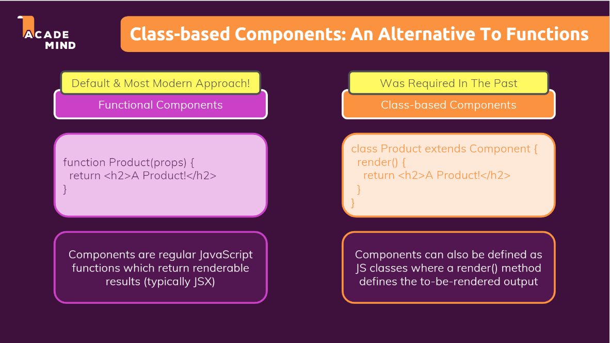
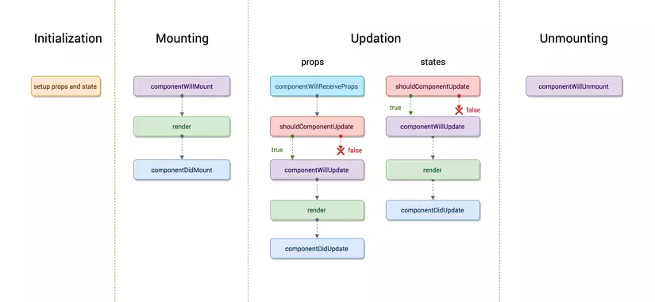
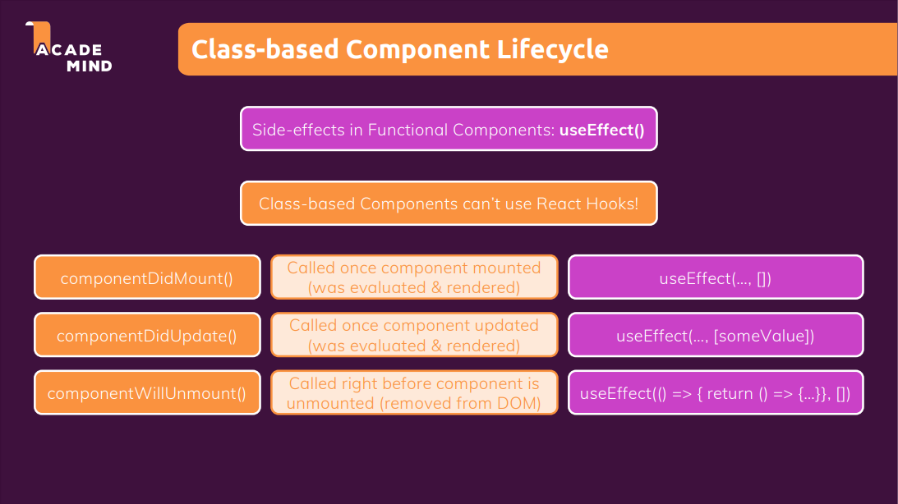
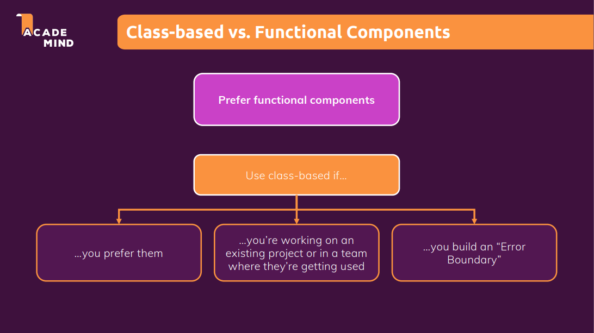

##### Table of content

- [Class-based Components](#class-based-components)
  - [Class-based Component](#class-based-component)
  - [Syntax](#syntax)
  - [Lifecycle Component](#lifecycle-component)
  - [Class-based Component vs Function Component](#class-based-component-vs-function-component)

# Class-based Components

## Class-based Component

- Trước đây, cụ thể là trước version 16.8 của React không tồn tại Hooks nên chúng ta không thể nào quản lý state và thực thi của "side effect" bên trong **Function Component**, **Function Component** lúc đó chỉ đơn giản là một "pure function" để render JSX code, và lúc đó chúng ta phải xây dựng các component bằng class để có thể quản lý state cũng như thực thi các "side effect".
- Tuy nhiên bản React 16.8 đã giới thiệu Hooks cũng với các method đi kèm, lúc này ta mới có thể xây dựng component với function song song với class.



- Một điều lưu ý là Hooks không thể được sử dụng bên trong các class-based component, và trong một project chúng ta có dụng kết hợp giữa **Function Component** và **Class-based Component**.

## Syntax

- Để có thể khởi tạo một Class-based Component, chúng ta sẽ khởi tạo một class được kế thừa từ React.Component để có thể xây dựng thành một component từ các method cũng như proptety được React cung cấp.
- Có 2 method cần quan tâm là `constructor()` và `render()`:
  - Phương thức `constructor()` sẽ nơi để chúng ta khởi tạo các state, một điều lưu ý là state trong Class-based Component luôn luôn là một object và chúng phải gom tất cả state mà chúng ta muốn khởi tạo trong object. Khi chúng ta cần cập nhật state thì chúng ta sẽ gọi phương thức setState thông qua this và chúng ta bắt buộc phải truyền vào một object mới hoặc một callback function nếu chúng ta cần cập nhật dựa vào state cũ. Một điều lưu ý khác với setState của useState hook là **override**, thì phương thức setState trong Class-based Component là **merge**.
  - Phương thức `render()` có nhiệm vụ là render các JSX code tương tự như return trong **Function Component**.

```
import { Component } from "react";

import classes from "./User.module.css";

class ComponentName extends Component {
  constructor() {
    super();

    // Khởi tạo các state trong đây
    this.state = {}
  }

  // Render các JSX code trong method render
  render() {
    return <div></div>;
  }

  // Khởi tạo các method đi kèm ở đây
  updateState() {
    this.setState({newStateObject});
  }
}
```

## Lifecycle Component

- Mỗi component trong React đều có một lifecycle (vòng đời) bao gồm: Mounting, Updation và Unmouting. Tương ứng với từng vòng đời sẽ có các phương thức đi kèm.



- Tùy vào từng logic mà chúng ta xử lý thì chúng ta sẽ sử dụng các phương thức cho phù hợp, để có thể tham khảo thêm về các phương thức thì tìm hiểu thêm tại: [Lifecycle Component trong ReactJS](https://viblo.asia/p/lifecycle-component-trong-reactjs-gGJ59jzxKX2) và [State and Lifecycle](https://reactjs.org/docs/state-and-lifecycle.html).
- Có 3 phương thức được sử dụng phổ biến:
  - `componentDidMount()` (Mounting): được gọi sau khi render component.
  - `componentDidUpdate()` (Updation): được gọi sau khi component re-render.
  - `componentWillUnmount()` (Unmouting): được gọi sau khi component bị remove ra khỏi DOM.



## Class-based Component vs Function Component


