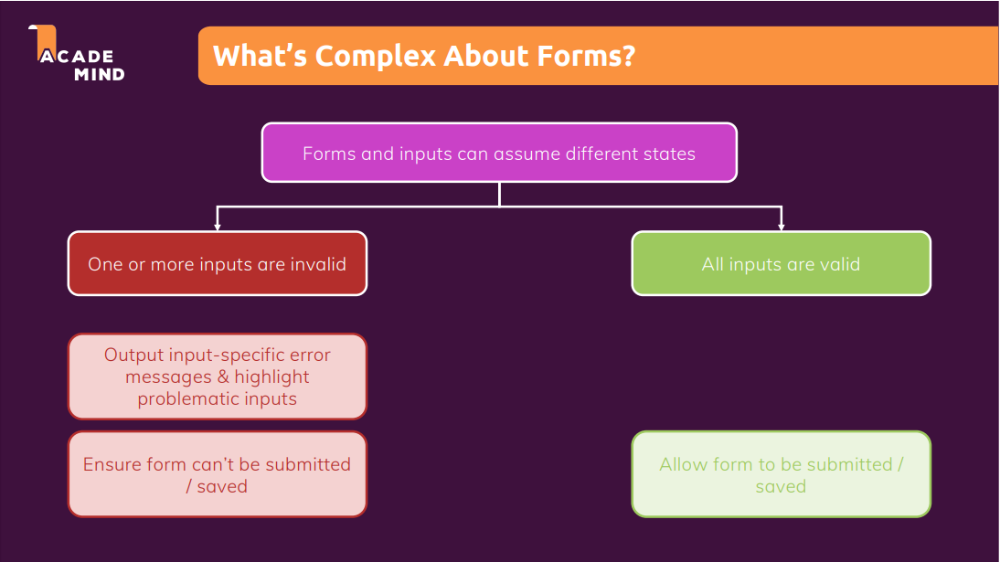
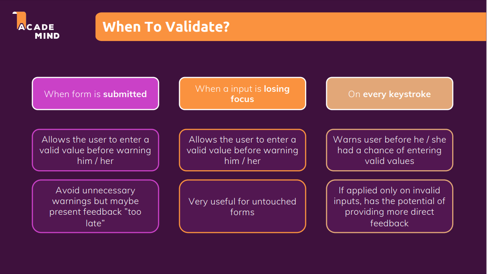

# Working with Forms & User Input

Tham khảo:

1. [Creating a Custom useForm Hook](https://academind.com/tutorials/reactjs-a-custom-useform-hook/)
2. [Formik: Build forms in React, without the tears](https://formik.org/)
