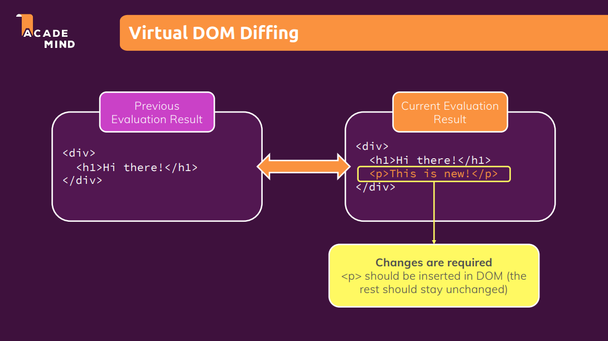
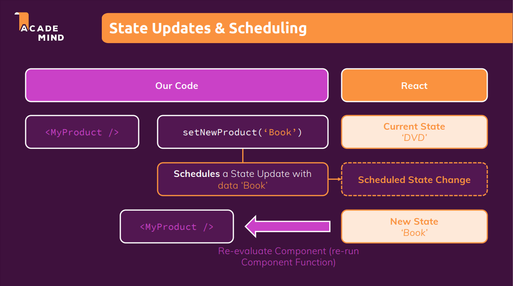
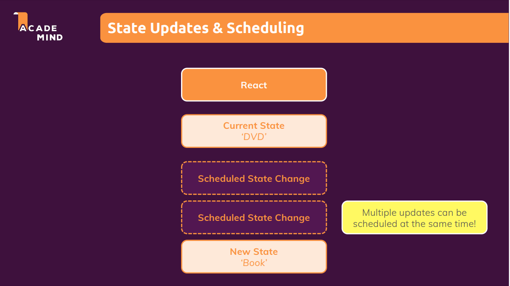

##### Table of content

- [ReactJS - The Complete Guide](#reactjs---the-complete-guide)
  - [React là gì? Công dụng của React](#react-là-gì-công-dụng-của-react)
  - [Cách hoạt động của React](#cách-hoạt-động-của-react)
  - [State Scheduling and Batching](#state-scheduling-and-batching)
  - [Controlled Components và Uncontrolled Components](#controlled-components-và-uncontrolled-components)

# ReactJS - The Complete Guide

## React là gì? Công dụng của React

- React là một thư viện JavaScript để xây dựng giao diện người dùng.
- React giúp cho việc thao tác trên giao diện trở nên nhanh chóng và "mượt mà" hơn. Bởi vì người dùng sẽ không phải chờ đợi khi nhấn vào một button, một tab mới hoặc một trang mới được tải lại trên một trang web được xây dựng bằng thư viện React.
- React là một thư viện JavaScript ở phía client, nên việc "render" giao diện sẽ được thực hiện ở phía client, nên đối với trang web được xây dựng bằng react sẽ không cần phải gửi request để server trả về và "render" giao diện, do đó mọi thao tác trên trang web react sẽ không có độ trễ vì không cần phải tại lại trang.
- Ngoài ra React còn cung cấp cho "developer" rất nhiều tính năng và công cụ khác nhau để xây dựng các giao diện người dùng phức tạp trở nên dễ dàng.
- Đối với các trang web được xây dựng bởi react, thì các thành phần (components) của trang web đó sẽ được chia nhỏ ra, và mỗi component sẽ có một chức năng riêng khác nhau. Do đó sẽ giúp ích cho việc tái sử dụng các thành phần component, đồng thời cũng giúp dễ dàng hơn trong việc quản lý và bảo trì.
- Đối với các trang web được xây dựng bởi react, thì các thành phần (components) của trang web đó sẽ được chia nhỏ ra, và mỗi component sẽ có một chức năng riêng khác nhau. Do đó sẽ giúp cích cho việc tái sử dụng các thành phần component, ddoondf thời cũng giúp trang web được xây dựng

## Cách hoạt động của React

- React là một thư viện xây dựng giao diện người dùng; tuy nhiên React chỉ thật sự quản lý các component, state, props, context và các dữ liệu đi kèm; còn việc hiển thị lên giao diện thì ReactDOM sẽ thực hiện.
- Trong thực tế React sẽ sử dụng Virtual DOM (DOM ảo), DOM ảo sẽ tương tự như DOM thật (HTML DOM) tuy nhiên nó không có khả năng tương tác lên browser.
- React lấy một snapshot của Virtual DOM (có thể hiểu là bản ghi trạng thái ngay lúc đó) ngay trước khi áp dụng bất kỳ bản cập nhật nào. Sau đó, nó sử dụng snapshot này để so sánh với Virtual DOM sau khi được cập nhật. Khi props, state hoặc context thay đổi thì lúc này component sẽ được render lại, do đó Virtual DOM sẽ được cập nhật. Quá trình tiếp theo React sử dụng thuật toán Diffing để so sánh và đối chiếu để biết được sự cập nhật được diễn ra ở đâu sau đó sẽ thông báo cho ReactDOM. Lúc này ReactDOM sẽ tương tác với DOM thật và chỉ cập nhật những element thay đổi và bỏ qua những elements không liên quan.
- Với việc sử dụng DOM ảo thì sẽ giúp cho hiệu suất của trang web tốt hơn, bởi vì **mỗi lần re-render component thì element tương ứng với các child element trong DOM ảo sẽ được tạo lại mới (component và các child component bên trong nó đều sẽ được re-render lại)**, tuy nhiên việc tạo lại chưa chắc sẽ khác so với phiên bản cũ, do đó nếu như React tương tác với DOM thật để cập nhật toàn bộ DOM sẽ tốn rất nhiều chi phí hơn so với việc chỉ cập nhật những thành phần thay đổi, giúp cho hiệu suất của browser nhanh hơn.

## State Scheduling and Batching

Tham khảo: [State Scheduling and Batching in React](https://www.youtube.com/watch?v=VMbsYXsrhek)

## Controlled Components và Uncontrolled Components
