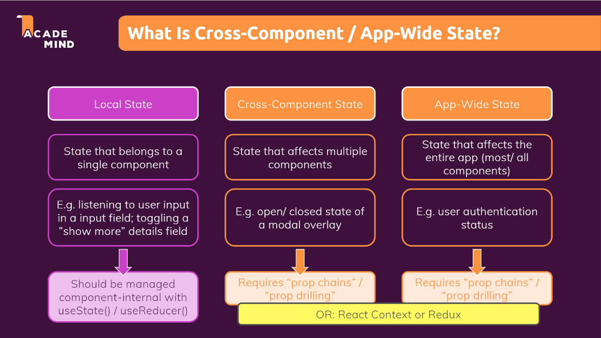
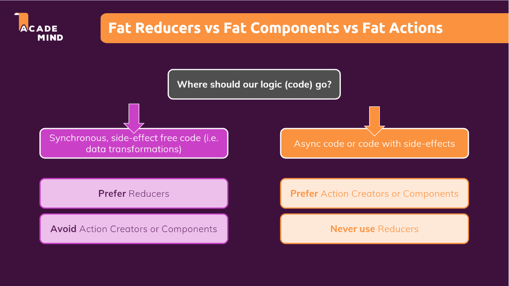
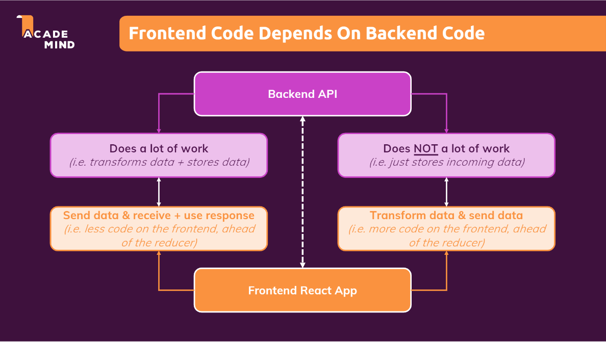

##### Table of content

- [Redux](#redux)
  - [Nhược điểm của React Context](#nhược-điểm-của-react-context)
    - [Các loại state trong React](#các-loại-state-trong-react)
    - [Nhược điểm của React Context](#nhược-điểm-của-react-context-1)
  - [Redux](#redux-1)
    - [Định nghĩa](#định-nghĩa)
    - [Cách hoạt động của Redux](#cách-hoạt-động-của-redux)
  - [Cách sử dụng Redux](#cách-sử-dụng-redux)
    - [Sử dụng Redux tách biệt với React](#sử-dụng-redux-tách-biệt-với-react)
    - [Sử dụng Redux với React kèm với package "react-redux"](#sử-dụng-redux-với-react-kèm-với-package-react-redux)
  - [Redux-toolkit](#redux-toolkit)
  - [Async Tasks with Redux](#async-tasks-with-redux)
  - [Redux Thunk](#redux-thunk)

# Redux

## Nhược điểm của React Context

### Các loại state trong React



### Nhược điểm của React Context


1. Setup phức tạp.


2. React Context không tối ưu hóa về hiệu năng do khả năng cập nhật state không tốt (chậm).


## Redux

### Định nghĩa


### Cách hoạt động của Redux


- Về cơ bản Redux hoạt động khá tương tự như useReducer hook, tuy nhiên khác biệt là Redux chỉ có 1 store duy nhất và được gọi là **Central Data (State) Store**, store này sẽ chứa tất cả các state mà chúng ta sẽ sử dụng trong toàn bộ chương trình.
- **Redux store** sẽ có nhiệm vụ là cung cấp các state cần thiết cho các component đã đăng ký (subscribe component), khi một component muốn thực hiện cập nhật state thì không thể cập nhật trực tiếp state đó trên **Redux store** mà phải thực hiện dispatch một action cho **Reducer Function**, lúc này **Reducer Function** sẽ có nhiệm vụ là nhận action đã được component dispatch và sẽ cập nhật state sau đó trả về state mới cho Redux store.
- Khi **Redux store** nhận được state mới từ **Reducer Function** thì sẽ cập nhật lại state mới bên trong **Redux Store**, đồng thời sẽ thông báo và truyền state mới cho Component để render lại UI.

## Cách sử dụng Redux

### Sử dụng Redux tách biệt với React

- Đầu tiên chúng ta phải import thư viện với cú pháp `require()` của NodeJS.

  ```
  const redux = require("redux");
  ```

- Sau đó chúng ta sẽ tạo store với phương thức `createStore()` được cung cấp bởi thư viện redux, đồng thời chúng ta sẽ tạo reducer function với đầu vào là state (trước đó) và action và return về state mới.

  ```
  const counterReducer = (state = { counter: 0 }, action) => {
    if (action.type === "increment") {
      return {
        counter: state.counter + 1,
      };
    }

    if (action.type === "decrement") {
      return {
        counter: state.counter - 1,
      };
    }

    return state;
  };

  const store = redux.createStore(counterReducer);
  ```

- Tiếp theo chúng ta sẽ đăng ký các component sử dụng store bằng phương thức `subscribe()`. Tất cả các component sử dụng phương thức `getState()` sẽ được đăng ký với redux store, khi đó redux store sẽ trả về state cho các component đó, đồng thời mỗi khi cập nhật state thì redux store sẽ thông báo cho các component đó render lại UI.

  ```
  const counterSubscriber = () => {
    const latestState = store.getState();
    console.log(latestState);
  };

  store.subscribe(counterSubscriber);
  ```

- Để có thể cập nhật state thì chúng ta sẽ sử dụng phương thức `dispatch(action)` và truyền vào action.

  ```
  store.dispatch({ type: "increment" });
  store.dispatch({ type: "decrement" });
  ```

**Full Code:**

```
const redux = require("redux");

const counterReducer = (state = { counter: 0 }, action) => {
  if (action.type === "increment") {
    return {
      counter: state.counter + 1,
    };
  }

  if (action.type === "decrement") {
    return {
      counter: state.counter - 1,
    };
  }

  return state;
};

const store = redux.createStore(counterReducer);

const counterSubscriber = () => {
  const latestState = store.getState();
  console.log(latestState);
};

store.subscribe(counterSubscriber);

store.dispatch({ type: "increment" });
store.dispatch({ type: "decrement" });
```

### Sử dụng Redux với React kèm với package "react-redux"

- Cũng tương tự như trên chúng ta cũng sẽ tạo redux store và redux function, tuy nhiên chúng ta sẽ export store để có thể sử dụng cho toàn bộ chương trình.

  ```
  import { createStore } from "redux";

  const reducerFunction = (state = { counter: 0 }, action) => {
    if (action.type === "increment") {
      return {
        counter: state.counter + 1,
      };
    }

    if (action.type === "decrement") {
      return {
        counter: state.counter - 1,
      };
    }

    return state;
  };

  const store = createStore(reducerFunction);

  export default store;
  ```

- Tiếp theo chúng ta cần wrap toàn bộ chương trình hoặc các component để định nghĩa phạm vi sử dụng redux store giống như useContext, đồng thời chúng ta cũng sẽ truyền store thông qua props.

  ```
  import React from "react";
  import ReactDOM from "react-dom/client";
  import { Provider } from "react-redux";

  import App from "./App";
  import store from "./store/index";

  import "./index.css";

  const root = ReactDOM.createRoot(document.getElementById("root"));
  root.render(
    <Provider store={store}>
      <App />
    </Provider>
  );
  ```

- Các component muốn truy cập redux store để lấy state thì cần phải sử dụng hook `useSelector()`, đầu vào của `useSelector()` và callback function return về state cần sử dụng.
- Các component có thể dispatch một action để cập nhật state thông qua reducer function bằng hook `useDispatch()`, `useDispatch()` sẽ trả về một dispatch function cho phép call với đầu vào là action mà chúng ta cần cập nhật.

  ```
  import { Component } from "react";
  import { useSelector, useDispatch, connect } from "react-redux";

  import classes from "./Counter.module.css";

  const Counter = () => {
    const dispatch = useDispatch();
    const counter = useSelector((state) => state.counter);

    const incrementHandler = () => {
      dispatch({ type: "increment" });
    };

    const decrementHandler = () => {
      dispatch({ type: "decrement" });
    };

    const toggleCounterHandler = () => {};

    return (
      <main className={classes.counter}>
        <h1>Redux Counter</h1>
        <div className={classes.value}>{counter}</div>
        <div>
          <button onClick={incrementHandler}>Increment</button>
          <button onClick={decrementHandler}>Decrement</button>
        </div>
        <button onClick={toggleCounterHandler}>Toggle Counter</button>
      </main>
    );
  };

  export default Counter;
  ```

## Redux-toolkit

- Với cách sử dụng Redux thông thường thì để setup một redux store quá phức tạp, bởi vì chúng ta phải tạo một Redux Function chứa các xử lý logic với từng action cụ thể và return về một object state mới chứa toàn bộ các state (kể ra state được thay đổi và state không thay đổi). Đồng thời để tránh phải nhầm lẫn với các action type thì chúng ta phải tạo một **Action Object**,...
- Với sự ra đời của redux-toolkit cho phép chúng ta sử dụng Redux tốt và đơn giản hơn, redux-toolkit cung cấp những phương thức giúp ta dễ dàng quản lý state và action khi chương trình lớn và phức tạp.

Bên trong store

```
import { createSlice, configureStore } from "@reduxjs/toolkit";

const initialState = { counter: 0, showCounter: true };

const counterSlice = createSlice({
  name: "counter",
  initialState,
  reducers: {
    increment(state) {
      state.counter++;
    },
    decrement(state) {
      state.counter--;
    },
    increase(state, action) {
      state.counter = state.counter + action.payload;
    },
    toggleCounter(state) {
      state.showCounter = !state.showCounter;
    },
  },
});

const store = configureStore({
  reducer: counterSlice.reducer,
});

export const counterActions = counterSlice.actions;
export default store;
```

Bên trong component

```
import { useSelector, useDispatch } from "react-redux";
import { counterActions } from "../store/index";

import classes from "./Counter.module.css";

const Counter = () => {
  const dispatch = useDispatch();
  const counter = useSelector((state) => state.counter);
  const showCounter = useSelector((state) => state.showCounter);

  const incrementHandler = () => {
    dispatch(counterActions.increment());
  };

  const increseHandler = () => {
    dispatch(counterActions.increase(10));
  };

  const decrementHandler = () => {
    dispatch(counterActions.decrement());
  };

  const toggleCounterHandler = () => {
    dispatch(counterActions.toggleCounter());
  };

  return (
    <main className={classes.counter}>
      <h1>Redux Counter</h1>
      {showCounter && <div className={classes.value}>{counter}</div>}
      <div>
        <button onClick={incrementHandler}>Increment</button>
        <button onClick={increseHandler}>Increment by 10</button>
        <button onClick={decrementHandler}>Decrement</button>
      </div>
      <button onClick={toggleCounterHandler}>Toggle Counter</button>
    </main>
  );
};

export default Counter;
```

Tham khảo:

1. [[React] Cùng tìm hiểu về Redux Toolkit, một phiên bản mới của Redux](https://viblo.asia/p/react-cung-tim-hieu-ve-redux-toolkit-mot-phien-ban-moi-cua-redux-XL6lA6yg5ek)
2. [Redux toolkit - Refactor lại redux structure](https://viblo.asia/p/redux-toolkit-refactor-lai-redux-structure-RQqKL0pmK7z)

## Async Tasks with Redux






## Redux Thunk

- Redux Thunk là một Middleware cho phép bạn viết các Action trả về một function thay vì một plain javascript object bằng cách trì hoãn việc đưa action đến reducer.
- Redux Thunk được sử dụng để xử lý các logic bất đồng bộ phức tạp cần truy cập đến Store hoặc đơn giản là việc lấy dữ liệu như Ajax request (giả sử chúng ta cần gửi dữ liệu sau khi được biến đổi trong store để gửi về server, chúng ta có thể xử lý bằng cách lấy dữ liệu sau khi biến đổi bên trong store và thực hiện gọi api để gửi dữ liệu, hoặc chúng ta có thể sử dụng **Redux Thunk** để tạo một action và chúng ta sẽ viết logic gọi api gửi dữ liệu bên trong đó bởi vì Redux không cho phép chúng ta viết async code bên trong Reducer).


Tham khảo:

1. [How Does Redux-Thunk Work?](https://user3141592.medium.com/understanding-the-redux-thunk-source-code-b3f8b930faf6)
2. [Tìm hiểu về Redux Thunk](https://viblo.asia/p/tim-hieu-ve-redux-thunk-Qbq5Qkm4ZD8)
3. [Writing Logic with Thunks](https://redux.js.org/usage/writing-logic-thunks)
